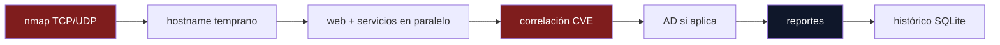

<div align="center">

```
   ██████╗ ███████╗ ██████╗ ██████╗ ███╗   ██╗
   ██╔══██╗██╔════╝██╔════╝██╔═══██╗████╗  ██║
   ██████╔╝█████╗  ██║     ██║   ██║██╔██╗ ██║
   ██╔══██╗██╔══╝  ██║     ██║   ██║██║╚██╗██║
   ██║  ██║███████╗╚██████╗╚██████╔╝██║ ╚████║
   ╚═╝  ╚═╝╚══════╝ ╚═════╝ ╚═════╝ ╚═╝  ╚═══╝
```

**Framework de reconocimiento modular open source para hackers éticos**

🐾 por [DarthBear](https://xx-darthbear-xx.github.io) · HTB, TryHackMe, eJPT, OSCP labs, engagements autorizados

[](CHANGELOG.md)
[](LICENSE)
[](requirements.txt)
[](tests/)
[](SECURITY.md)

[Inicio rápido](#-inicio-rápido) ·
[Features](#-qué-hace) ·
[Comandos](#-referencia-de-comandos) ·
[Arquitectura](#-arquitectura) ·
[Seguridad](#-seguridad) ·
[Contribuir](#-contribuir)

</div>

---

## ⚠️ Uso ético únicamente

Esta herramienta está pensada **exclusivamente** para laboratorios
autorizados (HackTheBox, TryHackMe, eJPT, OSCP labs) y engagements de
pentesting con autorización explícita por escrito. El autor no se hace
responsable del uso indebido contra sistemas sin autorización. Ver
[`LICENSE`](LICENSE) para el aviso completo.

## 🚀 Inicio rápido

```bash
git clone https://github.com/xX-DarthBear-Xx/recon.git
cd recon
pip install -r requirements.txt --break-system-packages

# Lo más simple posible: un solo flag, el motor de reglas decide el resto
python3 recon.py 10.129.121.28 -n ghostlink --auto
```

Eso ya te da: escaneo TCP/UDP, enumeración de servicios, correlación de
CVEs, detección de misconfiguraciones, y —si el propio motor de reglas
decide que vale la pena— screenshots, PDF, grafo de ataque y tickets,
todo documentado con su razón en `decisiones-autopiloto.md`.

## 🎯 Qué hace

<table>
<tr><td width="33%" valign="top">

### 🔍 Reconocimiento
- Nmap TCP/UDP completo + targeted
- Web (headers, whatweb, dirs, vhosts)
- SMB, FTP, DNS, SNMP, LDAP, SMTP, DBs
- Servicios en **paralelo** (threads)
- Resuelve hostname real antes de enumerar directorios

</td><td width="33%" valign="top">

### 🛡️ Vulnerabilidades
- Correlación CVE vía NVD (+ modo offline)
- Niveles de confianza HIGH/MEDIUM/LOW
- Verificación con `nuclei` y templates YAML propios
- Grafo de ataque (credencial → dónde reusarla)
- Misconfiguraciones (`.git`, `.env`, backups)

</td><td width="33%" valign="top">

### 🏰 Active Directory
- `rpcclient` null session
- `kerbrute` userenum + AS-REP roasting
- Sugerencia de Kerberoasting
- BloodHound collection
- Detecta patrón DC automáticamente

</td></tr>
<tr><td width="33%" valign="top">

### 📄 Reportes
- PDF profesional (plantilla OSCP)
- HTML interactivo + dashboard
- Tickets para Jira/Trello
- Multi-idioma (ES/EN)
- Análisis final vía LLM (`--assist-final`)

</td><td width="33%" valign="top">

### 🤖 Automatización
- `--auto`: motor de reglas, decide por ti
- `--core-only`: solo lo esencial
- `--resume`: reanuda sin repetir
- Batch mode (`--targets-file`)
- Plugins de usuario sin tocar el código

</td><td width="33%" valign="top">

### 👥 Equipo
- Servidor colaborativo (`team_server.py`)
- API REST (`api_server.py`)
- Webhooks Discord/Slack
- Histórico SQLite con patrones propios
- Modo `self-audit` para tu propia infra

</td></tr>
</table>

## 📊 Ejemplo de salida

Cada máquina genera un workspace completo bajo `workspaces/<nombre>/`:

```
workspaces/ghostlink/
├── attack-surface.md          ← puertos, hostnames, entry points
├── README.md                  ← resumen autogenerado
├── report.pdf                 ← reporte profesional (--pdf-report)
├── ANALISIS-FINAL.md          ← análisis del LLM (--assist-final)
├── 06_vulnerabilities/
│   ├── findings.md            ← CVEs con severidad, confianza, PoC
│   ├── attack-graph.png       ← credencial → dónde reusarla
│   └── tickets.csv            ← listo para importar a Jira
└── 07_credentials/
    └── credentials-found.md   ← requiere verificación manual
```

## 🧠 Filosofía de diseño

> Autonomía en **qué documentar**, nunca en **qué tan agresivo ser**.

Todo lo que toca el objetivo más allá de lectura pasiva (`--active-verify`,
`--auto-exploit`, `--param-fuzz`) requiere pedirse explícitamente — ni
siquiera `--auto` los activa por su cuenta. Ningún módulo ejecuta un
exploit real: como mucho clona un PoC para que **tú** lo revises.

## 📖 Referencia de comandos

<details>
<summary><b>Básico</b></summary>

```bash
python3 recon.py 10.129.121.28 -n ghostlink                    # normal
python3 recon.py 10.129.121.28 -n ghostlink --deep              # agresivo
python3 recon.py 10.129.121.28 -n ghostlink --profile ctf        # perfil predefinido
```
</details>

<details>
<summary><b>Reportes</b></summary>

```bash
python3 recon.py 10.129.121.28 -n ghostlink --pdf-report --pdf-template oscp
python3 recon.py 10.129.121.28 -n ghostlink --html-report --screenshots
python3 recon.py 10.129.121.28 -n ghostlink --export-tickets ambos
python3 recon.py 10.129.121.28 -n ghostlink --assist-final   # requiere ANTHROPIC_API_KEY
```
</details>

<details>
<summary><b>Active Directory</b></summary>

```bash
python3 recon.py 10.129.50.10 -n dc01 --ad-domain corp.local --ad-userlist users.txt
```
</details>

<details>
<summary><b>Automatización</b></summary>

```bash
python3 recon.py 10.129.121.28 -n ghostlink --auto             # motor de reglas
python3 recon.py 10.129.121.28 -n ghostlink --core-only        # mínimo
python3 recon.py --targets-file hosts.txt --deep               # batch
python3 recon.py 10.129.121.28 -n ghostlink --resume           # reanudar
```
</details>

<details>
<summary><b>Offline / air-gapped</b></summary>

```bash
python3 prepare_offline.py --keywords Apache nginx OpenSSH   # una vez, con red
python3 recon.py 10.129.121.28 -n ghostlink --offline          # nunca toca la red
```
</details>

<details>
<summary><b>Equipo</b></summary>

```bash
python3 team_server.py                                          # servidor compartido
python3 recon.py 10.129.121.28 --team-server http://IP:5001 --member alice
python3 api_server.py                                            # API REST
```
</details>

Ver `python3 recon.py --help` para la lista completa (~40 flags).

## 🏗️ Arquitectura



Extensible sin tocar el core: cualquier `.py` en `modules/custom/` con
una función `run(ip, folder, context)` se auto-descubre y ejecuta.

## 🔒 Seguridad

Este proyecto pasó por una auditoría real — cada hallazgo se confirmó
con un exploit de prueba antes de corregirse. Ver [`SECURITY.md`](SECURITY.md)
para el detalle completo (path traversal, XSS, CSV injection, y qué
limitaciones quedan documentadas por no poder eliminarse del todo).

## 🤝 Contribuir

Ver [`CONTRIBUTING.md`](CONTRIBUTING.md). TL;DR: cualquier PR que agregue
algo que ejecute exploits sin confirmación humana se rechaza — el
principio de diseño de arriba no es negociable.

## 📜 Licencia

MIT — ver [`LICENSE`](LICENSE).

---

<div align="center">

**[⬆ volver arriba](#)**

</div>
